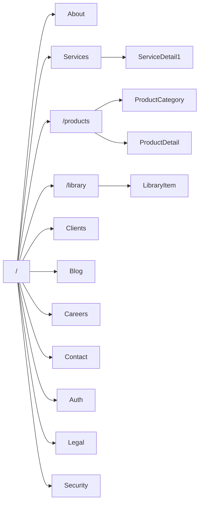
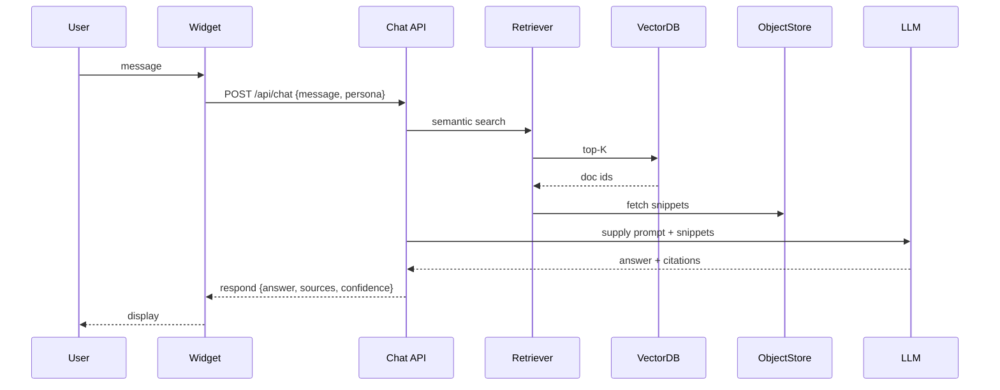
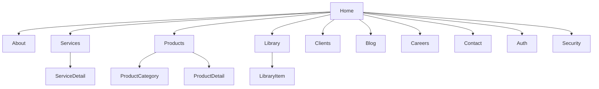
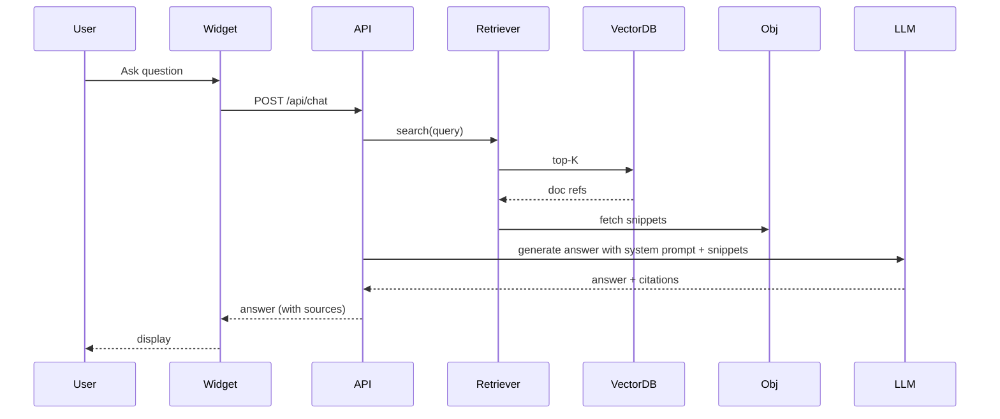

# EncryptArx (ECX) — Complete Public Website & Product Portal README

Authoritative, implementation-ready specification for the **public** site (Homepage, Services, Products Hub, Library, Chatbot (RAG), Forms, Authentication). This document intentionally **excludes** internal Admin/Dashboard details. Use this file as the canonical reference for designers, frontend & backend engineers, content owners, and security teams.

---

> **Visual palette (brand tokens you requested)**
> Primary palette (same family): `#2b8dbe` (primary-500), `#4896bd` (primary-400)
> Secondary: `#000000` (black)
> Gray shades: `#f7f7f8` (gray-50), `#e6e9ec` (gray-100), `#bfc6cd` (gray-300), `#8896a6` (gray-500), `#5b6672` (gray-700)

Use these tokens consistently across the site for backgrounds, accents, CTA gradients, and micro-interactions.

---

# Table of Contents

1. [Project Overview & Goals](#project-overview--goals)
2. [Audience & Success Metrics](#audience--success-metrics)
3. [Single-file sitemap (public)](#single-file-sitemap-public)
4. [Per-page detailed sections & required content (exact order)](#per-page-detailed-sections--required-content-exact-order)
5. [Design System — color tokens, typography, spacing, motion (code-ready)](#design-system---color-tokens-typography-spacing-motion-code-ready)
6. [Component Library — complete list + props + accessibility notes](#component-library---complete-list--props--accessibility-notes)
7. [Products Hub — taxonomy, metadata JSON schema, URL conventions & page structure](#products-hub---taxonomy-metadata-json-schema-url-conventions--page-structure)
8. [Library (Research Portal) — ingestion pipeline, metadata, APIs & UX details](#library-research-portal---ingestion-pipeline-metadata-apis--ux-details)
9. [Chatbot (RAG) — architecture, exact system prompts, sample conversation & response format](#chatbot-rag---architecture-exact-system-prompts-sample-conversation--response-format)
10. [Forms system — catalog, JSON Schemas, UX & backend flow (full)](#forms-system---catalog-json-schemas-ux--backend-flow-full)
11. [Authentication & Authorization — flows, DB models, endpoints (detailed)](#authentication--authorization---flows-db-models-endpoints-detailed)
12. [Core DB models (public surface) — SQL / Prisma-ready](#core-db-models-public-surface---sql--prisma-ready)
13. [Public API endpoints & contracts (OpenAPI-style summary)](#public-api-endpoints--contracts-openapi-style-summary)
14. [Security, privacy & compliance — controls, retention, vuln disclosure](#security-privacy--compliance---controls-retention-vuln-disclosure)
15. [SEO, Analytics, Accessibility & Performance (practical rules)](#seo-analytics-accessibility--performance-practical-rules)
16. [Testing, QA & monitoring (public systems)](#testing-qa--monitoring-public-systems)
17. [Mermaid diagrams & wireframes (embedded)](#mermaid-diagrams--wireframes-embedded)
18. [Example payloads, prompts, snippets (copyable)](#example-payloads-prompts-snippets-copyable)
19. [Handoff deliverables (what to deliver next) — public scope only](#handoff-deliverables-what-to-deliver-next---public-scope-only)

---

# Project overview & goals

**Purpose:** Create a modern, trust-first, and technically authoritative public website for EncryptArx (ECX) to present Services (client engagements), a **separate Products Hub** (catalog & product detail pages — **not** on homepage), a searchable Research **Library**, and a high-quality, citation-aware Chatbot (RAG). Provide a full forms system (partners, contributors, booking, vulnerability reporting) and hybrid auth (email/password + Google + GitHub + magic-link + optional TOTP). All public content must be discoverable, secure, and SEO-friendly.

**Must-haves (non-negotiable):**

* Products must live in `/products` hub and never expose product details on homepage.
* Library seeded with company PDFs and used as authoritative source for the Chatbot.
* Chatbot returns answers with explicit citations from the Library.
* Full forms system with privacy and virus-scanning for uploads.
* OAuth: Google (Gmail) and GitHub support.
* No admin/dashboard details in this doc.

---

# Audience & success metrics

**Primary audiences:**

* Enterprise buyers (CISO / Head of IT / CTO)
* Developers & Integrators (SDKs, APIs)
* Researchers, contributors & academics
* Consumers (Defenza, other consumer products)
* Partners & recruiters

**Success metrics:**

* Conversion rate (Visitor → Contact / Demo request)
* Library engagement (searches, downloads, time-on-doc)
* Chatbot satisfaction/accuracy (citations used, upvotes)
* Lead quality (gated downloads → qualified leads)

---

# Single-file sitemap (public)



---

# Per-page detailed sections & required content (exact order)

> **Important**: each page section below includes the specific content required, exact microcopy suggestions (where applicable), components to use, and SEO/citation instructions.

---

## Homepage (`/`)

**Objective:** Clear, immediate trust + two clear audience paths (Clients (Services) vs Products Hub). Do **not** show product details here.

**Sections (top → bottom, in exact order):**

1. **Top navigation**: Logo (left), Links: Services, Products, Library, Clients, Blog, Careers, Contact; primary CTA (Request Assessment).
2. **Hero (full-width)**

   * H1: `Your Data’s Impregnable Citadel.`
   * Subhead: `Security-first engineering, AI-driven insights, and Web3 innovation — tailored solutions for enterprises and everyday users.`
   * CTAs: Primary `Request Assessment` (opens Booking/Consultancy form), Secondary `Explore Research` (`/library`).
   * Right-side visual: animated data orb or subtle isometric node graph (use `--accent` gradient from `#2b8dbe` → `#4896bd`).
3. **Client vs Product Quick Paths** (two large cards) — Card A: `For Clients — Services & Engagements` (link `/services`), Card B: `Products Hub — Catalog & Trials` (link `/products`).
4. **Core Capabilities** (chips with icons): Cybersecurity, AI/ML, Web3 & Blockchain, Cloud Security, Product Engineering, Threat Intelligence. Each chip leads to service pages.
5. **Featured Research** (carousel of 3 seeded Library items). Each tile shows title, author, year, and CTA `Open Paper`.
6. **Case Studies Preview** (3 short cards) — Problem → Approach → Impact / KPI (e.g., `MTTR improved by X%`). CTA: `Read Case Study`.
7. **Trusted by / Partners ribbon** — logos (lightbox links to partner writeups).
8. **Testimonials** — 2 to 3 quotes (client logo + 1-line impact).
9. **Chatbot CTA & microcopy** — `Ask our assistant` (persistent bottom-right widget).
10. **Footer** — contact details, quick links, legal, socials.

**SEO:** meta tags, H1/H2 hierarchy, `schema.org/Organization` JSON-LD in header.

---

## Services (`/services` + `/services/{slug}`)

**Services overview page**: hero, list of service category cards (Cybersecurity, AI/ML, Blockchain/Web3, Product Engineering, Cloud Security), `How we engage` timeline (PoC → Pilot → Deploy), `Why EncryptArx` trust points.

**Each Service Detail page (order):**

1. **Hero**: service one-liner + CTA `Request Proposal`.
2. **Problem statement** (3 bullets) — whom it affects.
3. **Our approach** (diagram: Assess → Harden → Monitor → Respond).
4. **Capabilities & deliverables** (detailed bullets: VAPT, Mobile App Security, PenTest, EDR integration, SOC enablement, ML model audit, smart contract audit).
5. **Tools & frameworks**: list (OWASP, MITRE ATT&CK, Nessus, Burp, MobSF, Wazuh, TensorFlow, Keras, etc.) — display as icon grid.
6. **Case studies** (relevant).
7. **CTA**: `Request Assessment` / `Schedule Consultation`.

**Copy & citation:** If any claim about certification or standard is made (ISO-27001 alignment), verify status before using exact phrasing; prefer `ISO-27001 aligned` if not certified.

---

## Products Hub (`/products`) — **Important: Separate from Homepage**

**Purpose:** product catalog, product filtering, product compare, product-level CTAs (trial/demo).

**Products Hub structure:**

1. **Hero**: Title: `Products Hub` — short intro: `Productized security & intelligence — modular, integrable, research-backed.`
2. **Search bar**: semantic + classic (hybrid). Placeholder: `Search products, SDKs, APIs, or detection engines`
3. **Category tiles** (Consumer Security, Enterprise Security, Detection Engines, APIs & SDKs, Developer Tools, Compliance Tools, R&D Prototypes).
4. **Filters**: Status (prototype/alpha/beta/GA), Platform, Access (public/gated/enterprise), Tags.
5. **Products grid**: `ProductCard` components (name, status badge, short tagline, tags, CTA `View details`).
6. **Compare tool**: select up to 3 products to compare features table.
7. **Footer CTA**: `Request Trial / Contact Sales`.

**URL conventions:**

* `/products` — hub
* `/products/category/{category-slug}` — category listing
* `/products/{product-slug}` — product detail

---

## Product Detail (`/products/{product-slug}`)

**Exact order (must be implemented exactly this order):**

1. **Hero** (name + status badge + primary CTA `Request Trial` or `Get Demo`)
2. **Top ribbon**: platforms, latest version, SLA (if any), license type
3. **Elevator summary** (2–3 sentences)
4. **Top 5 features** (icons + short text)
5. **Technical Architecture** — interactive diagram; hover nodes reveal component details and responsibilities. Provide downloadable architecture PDF.
6. **Quickstart** — code snippet for SDK/API + copy button + link to full docs.
7. **Live demo / Sandbox** — allow light sandbox in iframe or gated sandbox environment link.
8. **Integrations** — list connectors (SIEMs, cloud providers).
9. **Security & Compliance** — dataflow only section: what data is stored, retention, encryption, compliance badges (use factual phrasing).
10. **Related Research** — card list from Library (citation snippet).
11. **Case Studies** — cards showing outcomes using this product.
12. **Pricing & Licensing** — summary + `Contact Sales` / `Request Trial` CTA (gated as per access level).
13. **Changelog & Roadmap link** — small footer with `View changelog`.

---

## Library (`/library` & `/library/{item-slug}`)

**Core UX expectations:**

* Primary search input with NL suggestions (e.g., "papers on deepfake detection 2024") and typeahead.
* Facets: Type (Paper, Whitepaper, Article, Dataset, Video), Year, Author, Tags, Product Link.
* Results grid: `LibraryTile` showing title, authors, date, 30–40 word abstract, tags, `Open` / `Download` CTA.
* Item page: metadata (title, authors, DOI), full in-browser PDF viewer with highlights, BibTeX export, `Download` (gated if required), `Cite this` (copy formats).
* Admin ingestion pipeline: (see detailed section later) to extract metadata, chunk text, generate embeddings and store vector indices.

**Important:** seed Library with uploaded PDFs (`Company Profile` and `Corporate Profile`) and mark them as authoritative sources.

---

## Clients & Case Studies (`/clients`)

* Index with filters by industry and service. Each case page: Problem → Approach → Implementation (tools & architecture) → Outcome (metrics) → Testimonial & CTA.

---

## Blog & Insights (`/blog`)

* Posts with canonical structured content, related research links, tags, author bios, and `security advisory` special posts (severity labels + disclosure timeline).

---

## Contact (`/contact`) & Forms hub

* A central page linking to all distinct forms (Contact, Consultancy Booking, RFP, Partner/Collaborator, Contributor, Product Trial, Vulnerability Disclosure, Press, Careers). Each form is accessible by direct URL and via contextual CTAs.

---

# Design System — color tokens, typography, spacing, motion (code-ready)

**CSS / Tailwind color token snippet**

```js
// tailwind.config.js (colors snippet)
module.exports = {
  theme: {
    extend: {
      colors: {
        primary: {
          400: '#4896bd', // lighter
          500: '#2b8dbe', // main
        },
        secondary: {
          DEFAULT: '#000000'
        },
        gray: {
          50: '#f7f7f8',
          100: '#e6e9ec',
          300: '#bfc6cd',
          500: '#8896a6',
          700: '#5b6672'
        }
      }
    }
  }
}
```

**Design tokens (CSS variables)**

```css
:root{
  --color-primary-500: #2b8dbe;
  --color-primary-400: #4896bd;
  --color-secondary: #000000;
  --gray-50: #f7f7f8;
  --gray-100: #e6e9ec;
  --gray-300: #bfc6cd;
  --gray-500: #8896a6;
  --gray-700: #5b6672;
  --bg: #0B0F1A; /* optional dark theme */
}
```

**Typography**

* Headlines: `Sora, Space Grotesk, Inter` fallback.
* Body/UI: `Inter, Plus Jakarta Sans`.
* Sizes: 48 / 40 / 32 / 24 / 20 / 16 / 14.

**Spacing**

* Scale: 4 / 8 / 12 / 16 / 24 / 32 / 48 / 64.

**Motion rules**

* Entrance: 320ms, `cubic-bezier(.2,.9,.3,1)`
* Micro hover: 160ms.
* Respect `prefers-reduced-motion`.

**Accessible color usage**

* Primary CTA background: `--color-primary-500` with white text.
* Secondary CTA: `transparent` with `--color-primary-500` border.
* Links: `--color-primary-400`.

---

# Component Library — complete list + props + accessibility notes

> Implement as small atomic React + Tailwind components; include Storybook stories. Each component must include keyboard accessibility, ARIA attributes, and focus styles.

**Key components (short prop listing):**

1. `TopNav({ links: [{label, href}], primaryCta: {label, href} })`

   * accessibility: `role="navigation"`, skip link, mobile hamburger keyboard focus.

2. `Hero({ title, subtitle, primaryCta, secondaryCta, visual })`

   * visual accepts SVG/Canvas or React node.

3. `ProductCard({ name, slug, tagline, status, tags, image, ctaLabel })`

   * status: `prototype|alpha|beta|ga` — badge color mapping.

4. `ServiceCard({ icon, title, description, cta })`

5. `LibraryTile({ title, authors, date, type, tags, excerpt, onOpen, onDownload })`

6. `SearchBar({ placeholder, onSearch, suggestionsEndpoint })`

   * supports keyboard navigation of suggestions.

7. `ChatWidget({ baseApiUrl, botPersonas })`

   * includes upload button, persona switcher, accepts files up to 20MB by default.

8. `FormRenderer({ jsonSchema, onSubmit, initialData })`

   * supports multi-step via `uiSchema` hints.

9. `CodeBlock({ language, code, sandboxUrl })`

   * copy-to-clipboard & run-in-sandbox features.

10. `StatusBadge({ status })`

    * color-coded accessible labels with `aria-label`.

11. `FilterPanel({ facets, onChange })`

    * support keyboard navigation, `aria-expanded` states.

12. `Toast` / `Modal` / `Tooltip` / `Accordion` / `DataTable` — standard implementations with WAI-ARIA patterns.

---

# Products Hub — taxonomy, metadata JSON schema, URL conventions & page structure

**Product taxonomy (canonical):**

* Consumer Security
* Enterprise Security
* Detection Engines
* APIs & SDKs
* Developer Tools
* Compliance & Audit Tools
* R&D Prototypes

**Product JSON schema (complete)** — store in DB as `products` table or in headless CMS:

```json
{
  "$id": "https://encryptarx.in/schemas/product.json",
  "type": "object",
  "required": ["slug", "name", "status", "category"],
  "properties": {
    "id": {"type": "string","format":"uuid"},
    "slug": {"type": "string"},
    "name": {"type": "string"},
    "status": {"type":"string","enum":["prototype","alpha","beta","ga","deprecated"]},
    "category": {"type":"string"},
    "tags": {"type":"array","items":{"type":"string"}},
    "type": {"type":"string","enum":["app","api","sdk","library","service"]},
    "short_tagline": {"type":"string"},
    "summary": {"type":"string"},
    "long_description": {"type":"string"},
    "features": {"type":"array","items":{"type":"string"}},
    "technical_overview": {"type":"string"},
    "requirements": {"type":"array","items":{"type":"string"}},
    "integrations": {"type":"array","items":{"type":"string"}},
    "access_level": {"type":"string","enum":["public","gated","enterprise"]},
    "docs_url": {"type":"string","format":"uri"},
    "demo_url": {"type":"string","format":"uri"},
    "publications": {"type":"array","items":{"type":"string"}}, 
    "case_studies": {"type":"array","items":{"type":"string"}},
    "seo": {"type":"object"},
    "created_at": {"type":"string","format":"date-time"}
  }
}
```

**URL conventions:** canonical product URL: `/products/{product-slug}`
**Breadcrumb structure:** `Home > Products > {Category} > {Product}`

---

# Library (Research Portal) — ingestion pipeline, metadata, APIs & UX details

**Library metadata schema (canonical):**

```json
{
  "id": "uuid",
  "slug": "deepfake-detection-2024",
  "title": "Deepfake Detection Methods 2024",
  "authors": ["Name A","Name B"],
  "abstract": "string",
  "published_date":"YYYY-MM-DD",
  "type":"ResearchPaper|Whitepaper|Article|Dataset|Video",
  "tags":["deepfake","detection","ml"],
  "file_url":"s3://bucket/path.pdf",
  "access_level":"public|gated|private",
  "doi":"string|null",
  "created_at":"timestamp"
}
```

**Ingestion & indexing pipeline (technical steps — reproducible):**

1. **Upload** (via Admin UI or S3 direct). Immediately virus-scan file.
2. **Extract text**: use `pdftotext`/`pdfminer.six`/Apache Tika.
3. **Chunk**: break into 500–800 token chunks with context metadata (page#, offset).
4. **Normalize**: remove stop boilerplate, keep tables/snippets separately.
5. **Embeddings**: call embedding model (OpenAI or on-prem) for each chunk. Store vector with pointer to `library_item_id` and chunk metadata.
6. **Vector DB**: store in Pinecone / Milvus / Weaviate with `metadata` fields.
7. **Search index**: store full metadata in Postgres + store text in Elasticsearch for BM25 fallback.
8. **Postprocessing**: generate summary & suggested tags using an LLM if desired.
9. **Expose**: `GET /api/library?q=...` returns hybrid ranked results (semantic score + BM25).

**Library APIs**

* `GET /api/library?q=&type=&year=&tags=&product=&page=` — hybrid search
* `GET /api/library/{slug}` — metadata + viewer URL
* `POST /api/library/ingest` — push metadata to ingestion pipeline (admin only, excluded from public README for admin UI details)

**UX Features**

* `Open in viewer` loads in-page PDF viewer with highlight, copy snippet, BibTeX export, cite link.
* `Related items` computed by embedding similarity (top 5).

---

# Chatbot (RAG) — architecture, exact system prompts, sample conversation & response format

**Architecture (component-level)**

* **Widget (React)** — floating, supports persona switch, file upload (logs, pdfs).
* **Chat API (FastAPI / Express)** — session management, rate limiting, request orchestration.
* **Retriever** — vector DB query (top-K), then fetch text snippets from object store.
* **Reader (LLM)** — synthesize answer using system prompt + top-K snippets.
* **Composer** — builds response JSON with `answer` + `sources` + `confidence`.
* **Storage** — short-term conversation context store (Redis) and audit logs in DB.

**RAG sequence (Mermaid)**



**System prompt (exact — use this verbatim and adjust tokens/format per LLM):**

```
SYSTEM PROMPT:
You are EncryptArx Public Assistant. Use the authoritative Library as primary sources and always cite them in answers. Provide clear, concise, and correct information. Structure answers with: Short Summary (1-2 lines), Details (steps or explanation), Sources (list up to 3 Library items with title and link), Confidence (high/medium/low). If the question involves company/product facts, prefer exact Library documents (Company Profile / Corporate Profile). For technical remediation steps, provide explicit commands and mention assumptions. If not enough information, say "Insufficient info — suggest specific details" and propose next steps.

PERSONAS:
- Researcher: formal, citation-heavy.
- Incident Responder: triage-first, prioritized actions.
- Sales Engineer: ROI & integration-focused.
```

**Chat response JSON schema**

```json
{
  "answer":"markdown string",
  "confidence":"high|medium|low",
  "sources":[
    {"title":"Corporate Profile.pdf","url":"/library/corporate-profile","snippet":"..."}
  ],
  "actions":[{"type":"book_demo","label":"Book Demo","url":"/contact"}]
}
```

**File upload policy in chat**

* Allowed types: `.pdf, .txt, .log, .json, .pcap` (scanned). Max 20 MB client; server limit 50 MB. All files scanned automatically. If suspicious, return triage with `danger` flag and recommend secure PGP upload via Vulnerability Disclosure form.

**Escalation rules**

* If `confidence == low` AND `query_category == high_severity` (i.e., active incident), include `escalate` action that links to `Contact` and suggests immediate human analyst contact.

---

# Forms system — catalog, JSON Schemas, UX & backend flow (full)

**Forms catalog (public-facing):**

* `Contact Us`
* `Consultancy Booking` (book consultancy slot)
* `Project Brief / RFP`
* `Partner / Collaborator Request`
* `Contributor / Researcher Application`
* `Product Trial / Demo Request`
* `Vulnerability Disclosure` (secure + PGP)
* `Gated Asset Request` (whitepaper)
* `Feedback / Suggestion`
* `Careers / Application`
* `Press / Media Inquiry`
* `Research Collaboration Request`
* `Event / Workshop Booking`
* `Custom Quote Request`

**Form UX standard (applies to all)**

* Single-column layout on mobile default.
* Title + short purpose line.
* Required fields marked.
* Autosave for multi-step and file-heavy forms.
* File uploads show progress, size, and virus-scan status.
* Consent checkbox (link to privacy policy).
* Anti-abuse: honeypot field + reCAPTCHA v3/hCaptcha if suspicious.

**Vulnerability Disclosure JSON Schema (detailed, copyable)**

```json
{
  "$id":"https://encryptarx.in/schemas/vuln-disclosure.json",
  "type":"object",
  "required":["reporter_name","reporter_email","vuln_summary","consent"],
  "properties":{
    "reporter_name":{"type":"string","maxLength":200},
    "reporter_email":{"type":"string","format":"email"},
    "pgp_public_key":{"type":"string"},
    "vuln_summary":{"type":"string","maxLength":5000},
    "affected_product":{"type":"string"},
    "affected_versions":{"type":"string"},
    "exploit_steps":{"type":"string"},
    "proof_of_concept":{"type":"string"},
    "attachments":{"type":"array","items":{"type":"string","format":"uri"}},
    "severity":{"type":"string","enum":["low","medium","high","critical"]},
    "consent":{"type":"boolean"}
  }
}
```

**Form submission backend flow (exact steps):**

1. Client posts to `POST /api/forms/{formSlug}` (JSON or `multipart/form-data` for attachments).
2. Server validates JSON Schema (strict). Reject with `400` and validation errors if wrong.
3. If attachments present: server streams to virus scanning service (ClamAV/VT API). If malware found → immediate `422` with remediation suggestion. If clean → store in object storage (S3) with SSE.
4. Persist `forms_submissions` record with `payload` JSON + `attachments` metadata. Generate `submission_id`.
5. Send confirmation email to submitter with `submission_id` and next steps.
6. Trigger webhooks / notifications (CRM/Slack) as configured (server-side).
7. Return `201 { submission_id, status: "received" }` to client.

**Sample API response**

```json
{
  "submission_id":"f2c3a8e2-9b1a-4f9d-8a5c-12345678abcd",
  "status":"received",
  "message":"Thank you. Your Vulnerability report has been received."
}
```

---

# Authentication & Authorization — flows, DB models, endpoints (detailed)

**Supported auth methods (public):**

* Local email/password (Argon2id hashing)
* OAuth: Google (Gmail) & GitHub (OAuth2)
* Magic-link (passwordless) via email (optional)
* TOTP (optional MFA) — recommended for elevated roles

**User onboarding flow (exact):**

1. **Sign-up (local)**: `POST /api/auth/register {name,email,password}`. Create `user` with `status: pending_verification`. Send verification email with single-use token.
2. **Email verification**: `GET /api/auth/verify?token=...` validates & sets `email_verified=true`. Then create session.
3. **OAuth sign-in**: redirect to provider; provider returns profile. If `provider.email` matches existing user: either auto-link if `email_verified=true` or prompt for linking. If new → create user with `email_verified` set per provider claim.
4. **Magic-link**: `POST /api/auth/magic-link {email}` → send time-limited tokenized link.
5. **Password reset**: `POST /api/auth/forgot-password {email}` → token send & `POST /api/auth/reset-password {token,newPassword}`.

**DB models (core public tables) — SQL snippets**

`users` table:

```sql
CREATE TABLE users (
  id uuid PRIMARY KEY DEFAULT gen_random_uuid(),
  email text UNIQUE NOT NULL,
  email_verified boolean DEFAULT false,
  name text,
  password_hash text,
  role text DEFAULT 'user',
  meta jsonb DEFAULT '{}',
  created_at timestamptz DEFAULT now(),
  updated_at timestamptz DEFAULT now()
);
```

`oauth_accounts`:

```sql
CREATE TABLE oauth_accounts (
  id uuid PRIMARY KEY DEFAULT gen_random_uuid(),
  user_id uuid REFERENCES users(id) ON DELETE CASCADE,
  provider text NOT NULL,
  provider_account_id text NOT NULL,
  created_at timestamptz DEFAULT now(),
  UNIQUE(provider, provider_account_id)
);
```

`auth_tokens` (email verify, reset, magic link):

```sql
CREATE TABLE auth_tokens (
  id uuid PRIMARY KEY DEFAULT gen_random_uuid(),
  user_id uuid REFERENCES users(id),
  token_hash text NOT NULL,
  type text NOT NULL, -- email_verification, password_reset, magic_link
  created_at timestamptz DEFAULT now(),
  expires_at timestamptz,
  used boolean DEFAULT false
);
```

**Auth endpoints (public)**

* `POST /api/auth/register`
* `GET  /api/auth/verify?token=`
* `POST /api/auth/login`
* `POST /api/auth/magic-link`
* `GET  /api/auth/magic?token=`
* `POST /api/auth/forgot-password`
* `POST /api/auth/reset-password`
* `GET  /api/auth/oauth/{provider}` (redirect)
* `GET  /api/auth/oauth/{provider}/callback`

**Security specifics (must implement):**

* Argon2id for password hashing; tune memory/time params for production.
* Store only hashed tokens (`SHA256` or HMAC) for verification flows.
* Use HttpOnly, Secure cookies & sameSite settings.
* Implement brute-force protection & rate limits (Redis-based attempt counters).
* Enforce email verification before granting access to gated assets.

---

# Core DB models (public surface) — SQL / Prisma-ready

**Prisma example (simplified)**:

```prisma
model User {
  id            String   @id @default(uuid())
  email         String   @unique
  emailVerified Boolean  @default(false)
  name          String?
  passwordHash  String?
  role          String   @default("user")
  meta          Json?
  createdAt     DateTime @default(now())
  updatedAt     DateTime @updatedAt
  oauthAccounts OAuthAccount[]
}

model OAuthAccount {
  id        String @id @default(uuid())
  provider  String
  providerId String
  user      User   @relation(fields: [userId], references: [id])
  userId    String
  createdAt DateTime @default(now())

  @@unique([provider, providerId])
}
```

`library_items`, `products`, `forms_submissions` follow the schemas earlier.

---

# Public API endpoints & contracts (OpenAPI-style summary)

**Auth**

* `POST /api/auth/register` → `201 { userId, emailVerificationSent: true }`
* `POST /api/auth/login` → `200 { sessionToken }` + HttpOnly cookie
* `POST /api/auth/magic-link` → `200 { message }`

**Products**

* `GET /api/products` → `200 [{ product metadata }]`
* `GET /api/products/{slug}` → `200 { product }`

**Library**

* `GET /api/library?q=&type=&tags=&page=` → hybrid search results
* `GET /api/library/{slug}` → `200 { metadata, viewer_url }`

**Forms**

* `POST /api/forms/{slug}` → accepts JSON or multipart; returns `201 { submission_id }`

**Chat**

* `POST /api/chat` → accepts `{ message, sessionId, persona }` returns `{ answer, sources, confidence }` and supports streaming.

All endpoints use TLS and CORS policies. Public endpoints do not require auth except where gated resources are requested (`/products/{slug}` if `access_level` gated).

---

# Security, privacy & compliance — controls, retention, vulnerability disclosure

**Security controls (concrete list):**

* TLS 1.2+ with HSTS.
* CSP header to mitigate XSS.
* Argon2id password hashing.
* Tokens hashed in DB.
* WAF + rate-limiting for public endpoints.
* Server-side virus scanning for uploads (ClamAV or commercial + VirusTotal optional).
* Object storage SSE for file encryption.
* Secrets in vault (AWS Secrets Manager / HashiCorp).
* Audit logs for authentication and data-access events.

**Privacy & retention (default policy suggestions):**

* General inbound forms: retain 2 years.
* GDPR/DSR: implement data export & deletion endpoints.
* HR/applications: retain 7 years (or as local labor law).
* Vulnerability reports: retain per incident requirements; keep PII redaction options.

**Vulnerability disclosure (public page)**:

* Show PGP public key, instructions to encrypt sensitive data, contact email for security team, expected SLA windows (e.g., `72 hours to triage acknowledgment`). Provide an upload option via Vulnerability Disclosure form supporting encrypted artifacts.

---

# SEO, Analytics, Accessibility & Performance (practical rules)

**SEO**

* Use SSR for marketing pages (Next.js recommended).
* Schema.org JSON-LD: Organization + SoftwareApplication + Article/ResearchArticle for library items.
* Title & meta description per page; OG/Twitter tags.

**Analytics**

* GA4 + server events for: forms completion, demo requests, library downloads, chatbot interactions, search queries. Use hashed user identifiers for privacy.

**Accessibility**

* WCAG 2.1 AA baseline.
* All interactive elements keyboard navigable, visible focus styles, aria labels, skip links. Use semantic HTML for forms and items.

**Performance**

* Use CDN for static assets; optimize images; lazy-load heavy components (PDF viewer, maps).
* Cache responses for library search hot results; use ISR (Next.js) for product pages.

---

# Testing, QA & monitoring (public systems)

**Testing**

* Unit tests for React components (Jest/React Testing Library).
* Integration tests for API endpoints (Supertest / pytest).
* E2E tests for critical flows (Playwright / Cypress): signup, library search, form submission, chat basic flow.

**Security testing**

* SAST (e.g., Snyk), DAST in CI, dependency scanning & periodic pen testing.

**Monitoring**

* Sentry for error tracking, Prometheus/Grafana for infra metrics, uptime monitors. Monitor vector DB latency and LLM provider errors as high-severity alerts.

---

# Mermaid diagrams & wireframes (embedded)

**Sitemap (Mermaid)**



**Chatbot RAG flow**



**Homepage ASCII mockup**

```
+------------------------------------------------------------+
| Logo | Services | Products | Library | Clients | Contact CTA |
+------------------------------------------------------------+
| HERO: "Your Data’s Impregnable Citadel." [Request Assessment] |
| Subhead: ...                             [Explore Research] |
| [Client Path Card]   [Products Hub Card]                  |
+------------------------------------------------------------+
| Capabilities chips: Cybersecurity | AI/ML | Web3 | Cloud     |
+------------------------------------------------------------+
| Featured Research carousel                               |
+------------------------------------------------------------+
| Case Studies | Trusted by logos | Testimonials           |
+------------------------------------------------------------+
| Footer with quick links, social, legal                   |
+------------------------------------------------------------+
```

---

# Example payloads, prompts, snippets (copyable)

**Product JSON example**

```json
{
  "slug":"defenza",
  "name":"Defenza",
  "status":"beta",
  "category":"Consumer Security",
  "tags":["mobile","privacy","scam-detection"],
  "short_tagline":"Personal security assistant: real-time scam detection & file scanning."
}
```

**Library search request example**

```
GET /api/library?q=deepfake%20detection%20paper%202024
```

**Chatbot system prompt (copyable)**

```
You are EncryptArx Public Assistant. Use the library as primary source. Always include a Sources section listing up to 3 library items (title + link). Provide Confidence: high/medium/low. When uncertain, ask for clarifying details.
```

**NextAuth conceptual config snippet**

```ts
import NextAuth from "next-auth"
import GoogleProvider from "next-auth/providers/google"
import GitHubProvider from "next-auth/providers/github"

export default NextAuth({
  providers: [
    GoogleProvider({ clientId: process.env.GOOGLE_ID, clientSecret: process.env.GOOGLE_SECRET }),
    GitHubProvider({ clientId: process.env.GITHUB_ID, clientSecret: process.env.GITHUB_SECRET })
  ],
  secret: process.env.NEXTAUTH_SECRET,
  session: { strategy: "jwt" }
})
```

**Forms submission sample response**

```json
{
  "submission_id":"f2c3a8e2-9b1a-4f9d-8a5c-12345678abcd",
  "status":"received",
  "message":"Thank you. We'll email you confirmation within 24 hours."
}
```

---

# Handoff deliverables (public scope only)

Deliver the following artifacts (production-ready):

1. Figma file with Desktop + Mobile mockups (Homepage, Products Hub, Product Detail, Library list + item, Chat Widget screens, Form flows).
2. Tailwind config + CSS token file (colors supplied above).
3. Storybook + component stubs for `TopNav`, `Hero`, `ProductCard`, `LibraryTile`, `ChatWidget`, `FormRenderer`.
4. SQL / Prisma schema files for `users`, `products`, `library_items`, `forms_submissions`.
5. OpenAPI (YAML/JSON) for public endpoints.
6. Library ingestion scripts (Python) for PDF → text → embeddings (example).
7. Chatbot system prompt file + sample LLM wrapper (FastAPI example).
8. JSON Schemas for all public forms (Contact, Vulnerability Disclosure, Booking, etc.).
9. Testing matrix (unit / integration / E2E) and security checklist (SAST, DAST, secrets management).

---

# Final checklist (public items to verify before release)

* [ ] Homepage does not include product details — only links to `/products`.
* [ ] Company PDFs are ingested into Library and indexed for RAG citations.
* [ ] Vulnerability Disclosure PGP key & instructions present; secure upload in place.
* [ ] OAuth for Google & GitHub configured and tested (redirect URIs, secrets stored securely).
* [ ] Forms have server-side validation + virus scanning for uploads.
* [ ] Auth flows use Argon2id & hashed tokens; MFA optional.
* [ ] CSP, HSTS, secure cookies configured.
* [ ] SEO: SSR pages + JSON-LD structured data implemented.
* [ ] Accessibility: keyboard & screen-reader checks completed.