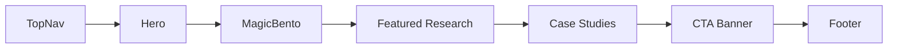
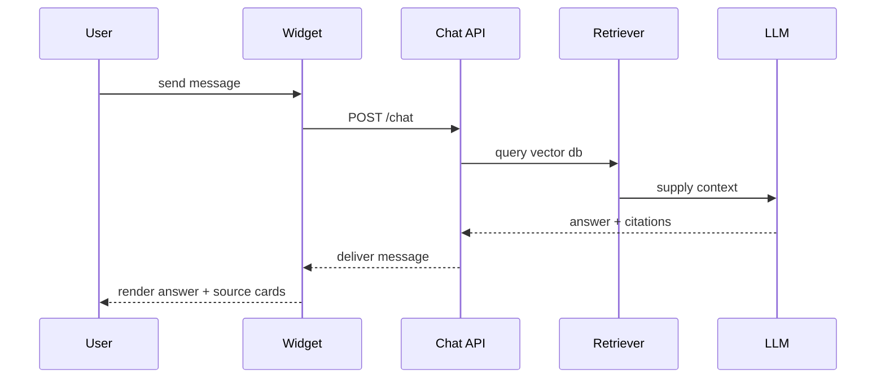

````markdown
# Visual System & Component Cookbook — Design-First README  
**Focus:** Complete, implementation-ready design guide for a dark-first, technical, highly-interactive product website.  
**Scope:** visual tokens, typography, layout, components, motion system, parallax/scroll effects, hero & landing treatments, component variants (cards, tiles, lists), chat UI, forms UX, accessibility, performance, and production-ready code patterns.  
**Primary Colors (use these exact values):**
- `--primary-500: #2b8dbe`  
- `--primary-400: #4896bd`  
- `--secondary: #000000`  
- Grays: `#f7f7f8` (50), `#e6e9ec` (100), `#bfc6cd` (300), `#8896a6` (500), `#5b6672` (700)

> This README concentrates purely on **design & visual implementation**. It collects best practices, component-level specs, motion recipes (from modern component systems), parallax patterns, and ready-to-use code snippets for CSS/Tailwind + Framer Motion. Use it as the definitive design reference for UI/UX teams and frontend engineers.

---

## Table of contents
1. [Design philosophy & principles](#design-philosophy--principles)  
2. [Design tokens (CSS & Tailwind-ready)](#design-tokens-css--tailwind-ready)  
3. [Typography scale & usage rules](#typography-scale--usage-rules)  
4. [Grid, spacing & responsive rules](#grid-spacing--responsive-rules)  
5. [Color usage, contrast & accessibility](#color-usage-contrast--accessibility)  
6. [Core components (full inventory + props + states)](#core-components-full-inventory--props--states)  
7. [Component variants & detailed specs (cards, library tiles, magic bento, etc.)](#component-variants--detailed-specs-cards-library-tiles-magic-bento-etc)  
8. [Motion system & animation library (Framer Motion configs)](#motion-system--animation-library-framer-motion-configs)  
9. [Parallax & layered scroll effects (patterns + implementation)](#parallax--layered-scroll-effects-patterns--implementation)  
10. [Hero treatments & landing visual recipes](#hero-treatments--landing-visual-recipes)  
11. [Chat widget & conversational UI visuals](#chat-widget--conversational-ui-visuals)  
12. [Forms, validation & file uploads (visual UX)](#forms-validation--file-uploads-visual-ux)  
13. [Accessibility & reduced-motion rules](#accessibility--reduced-motion-rules)  
14. [Performance & progressive enhancement (visual focus)](#performance--progressive-enhancement-visual-focus)  
15. [Page-level pattern gallery (blueprints & examples)](#page-level-pattern-gallery-blueprints--examples)  
16. [Mermaid diagrams (architecture & flows)](#mermaid-diagrams-architecture--flows)  
17. [Production-ready snippets (Tailwind + CSS variables + Framer Motion)](#production-ready-snippets-tailwind--css-variables--framer-motion)  
18. [Handoff checklist & design tokens manifest](#handoff-checklist--design-tokens-manifest)

---

## Design philosophy & principles
- **Dark-first, technical elegance:** surfaces are near-black/black; accents use the primary teal/azure family. This creates a high-tech, confident brand presence.  
- **Clarity & hierarchy:** large, crisp typography and generous spacing. Every page has one primary CTA; secondary interactions are visually subordinate.  
- **Component-first & composable:** build small, well-documented components (atoms → molecules → organisms). Each component must be usable in isolation and combined to create complex layouts.  
- **Data-driven visuals:** favor node/graph visuals, holographic panels, and subtle gradients to convey technical depth instead of photo-realistic stock images.  
- **Polished micro-interactions:** micro-animations guide attention — hover lifts, reveal fades, subtle parallax, typed loaders. Use motion to assist cognition, not distract.  
- **Performance-conscious motion:** animate transforms & opacity, avoid layout thrashing, respect `prefers-reduced-motion`.  
- **Accessible-by-default:** keyboard focus styles, screen reader labels, color contrast, and form validation messaging.

---

## Design tokens (CSS & Tailwind-ready)

### CSS variables (base)
```css
:root {
  --primary-500: #2b8dbe;
  --primary-400: #4896bd;
  --secondary: #000000;
  --white: #ffffff;
  --gray-50: #f7f7f8;
  --gray-100: #e6e9ec;
  --gray-300: #bfc6cd;
  --gray-500: #8896a6;
  --gray-700: #5b6672;

  /* surfaces */
  --surface-1: #050505; /* main background - nearly black */
  --surface-2: #0b0f12; /* panels / cards */
  --glass: rgba(255,255,255,0.04);

  /* elevation shadow */
  --shadow-1: 0 4px 16px rgba(2,6,23,0.6);
}
````

### Tailwind config snippet (colors)

```js
// tailwind.config.js (partial)
module.exports = {
  theme: {
    extend: {
      colors: {
        primary: {
          400: '#4896bd',
          500: '#2b8dbe'
        },
        secondary: '#000000',
        gray: {
          50: '#f7f7f8',
          100: '#e6e9ec',
          300: '#bfc6cd',
          500: '#8896a6',
          700: '#5b6672'
        },
        surface: {
          1: '#050505',
          2: '#0b0f12'
        }
      },
      boxShadow: {
        'soft-1': '0 8px 32px rgba(2,6,23,0.6)'
      }
    }
  }
}
```

---

## Typography scale & usage rules

* **Primary display:** Sora / Space Grotesk — use for H1/H2 large headings.
* **UI & body:** Inter or Plus Jakarta Sans for high legibility.
* **Scale (px):** 56 / 40 / 32 / 24 / 20 / 16 / 14 / 12
* **Line-height:** 1.05–1.25 for headings, 1.5 for body text.
* **Letter spacing:** 0 to 0.02em for readable UI.
* **Usage examples:**

  * H1 (56px) — hero headline
  * H2 (40px) — section headline
  * H3 (32px) — subhead
  * Body (16px) — paragraph

**Accessibility**: Ensure AA contrast for text on background (WCAG). Provide alternate color variables for high-contrast mode.

---

## Grid, spacing & responsive rules

* **Grid System:** 12-column grid (desktop ≥ 1280px), 16px gutters default.
* **Containers:** max-width 1280px (desktop), 960px (tablet), fluid (mobile).
* **Spacing scale:** 4 / 8 / 12 / 16 / 24 / 32 / 48 / 64 / 96 — use consistently for padding and margins.
* **Breakpoints:** `sm=640px`, `md=768px`, `lg=1024px`, `xl=1280px`, `2xl=1536px`.

---

## Color usage, contrast & accessibility

* **Primary CTA:** solid `--primary-500` background with white text. Button ripple/hint on hover.
* **Secondary CTA:** outline with `--primary-400` stroke on `--surface-2`.
* **Inactive / muted text:** `--gray-500`.
* **Cards & panels:** `--surface-2` with `--glass` overlay for glassmorphism accents.
* **Shadows & glow:** subtle glow for primary elements: `box-shadow: 0 0 24px rgba(43,141,190,0.12)` for hero visuals.

**Contrast checks**: ensure text on primary (2b8dbe) has accessible contrast—use white text for CTAs. Provide alternate dark-on-light tokens for print or light theme.

---

## Core components (full inventory + props + states)

This component list is exhaustive. Each component includes props, states, accessibility notes, and animation hooks.

1. **TopNav**

   * Props: `links[]`, `logo`, `primaryCta`, `searchEnabled`
   * States: collapsed/hamburger, sticky, scrolled (glass blur)
   * Accessibility: role="navigation", aria-expanded on menu toggle
   * Motion: slide down on reveal; blur on scroll (use CSS `backdrop-filter`)

2. **Hero**

   * Props: `title`, `subtitle`, `primaryCta`, `secondaryCta`, `visualNode`
   * VisualNode can be an animated SVG/Canvas or 3D data orb.
   * Motion: entrance stagger (text fade+slideY 320ms), visual subtle parallax.

3. **ProductCard / ServiceCard**

   * Props: `title`, `tagline`, `statusBadge`, `tags[]`, `image`, `ctaLabel`
   * States: hover (lift, glow), selected (outline), disabled (desaturation).
   * Motion: hover translateY(-6px) and shadow increase.

4. **MagicBento component (composite)** — inspired by ReactBits magic-bento

   * Layout: small grid of micro cards with staggered entrances and blurred glass background.
   * Props: `items[]` with `title, icon, metric, trend`
   * Motion: staggered spring entrance, micro hover expansion.

5. **LibraryTile**

   * Props: `title`, `authors`, `type`, `date`, `snippet`, `tags[]`, `ctaOpen`
   * On hover: flip to show highlights & citation (card flip with 3D transform).

6. **FilterPanel**

   * Props: `facets[]`, `onChange`
   * Behavior: sticky on left for desktop; collapsible on mobile.

7. **SearchBar (semantic)**

   * Props: `placeholder`, `suggestionsEndpoint`, `onSearch`
   * UX: NL prompt hints, typeahead, voice input optional.
   * Accessibility: ARIA combobox.

8. **ChatWidget**

   * Props: `personas[]`, `baseApi`, `allowUpload`
   * Features: persona switcher, mini transcript, file upload, source cards in responses, rating (thumbs).
   * Motion: typing indicator (waveform), card entrance.

9. **Modal & Drawer** — reusable with `trapFocus`, close on ESC, animated overlay fade + content scale.

10. **FormRenderer** — JSON schema driven renderer, supports multi-step, autosave (localStorage), validation.

11. **CodeBlock** — copy button, language select, run-in-sandbox option (for small demo snippets).

12. **Toast & Notification** — low-level notifications with timeout and pause-on-hover.

13. **StatusBadge** — color-coded statuses (prototype/alpha/beta/ga) with accessible labels.

14. **CompareTable** — dynamic rows with sticky header & column compare selection.

15. **Footer** — multi-column, small links, social icons, small logo.

---

## Component variants & detailed specs (cards, library tiles, magic bento, etc.)

### ProductCard — spec

* **Dimensions:** desktop card = 360x220px.
* **Layout:** icon left, content right or top image variant.
* **Tagline length:** ≦ 120 characters.
* **Status badge:** upper-right corner, rounded pill, color mapping: `prototype=#bfc6cd`, `alpha=#4896bd`, `beta=#2b8dbe`, `ga=#28d38a`.
* **Hover:** translateY(-6px), shadow soft-1, border glow `box-shadow: 0 6px 20px rgba(43,141,190,0.12)`.

### LibraryTile (flip variant)

* **Front:** type badge (PDF/Article/Video), title, authors, date, snippet (3 lines ellipsis), tags chips.
* **Back:** highlighted excerpt (first paragraph), citation export buttons, `Open` & `Download` CTA.
* **Animation:** 3D flip on hover using `transform: rotateY(180deg)` with `preserve-3d`. Fallback: fade if `prefers-reduced-motion`.

### Magic Bento (composite)

* **Grid:** 2x3 small tiles with staggered border radii and overlapping shadow layers.
* **Micro-metrics:** show metric number with small sparkline.
* **Entrance:** upward spring with slight overshoot (Framer Motion `type: "spring", stiffness: 120, damping: 16`).
* **Use:** landing hero features, dashboard snippets.

### CodeBlock

* **Visual:** dark code surface (surface-2), monospaced font, copy button top-right, run button (primary).
* **Motion:** on run, show loader pill then inline result block slide down.

---

## Motion system & animation library (Framer Motion configs)

**Global motion principles**

* Animate `transform` and `opacity` only. Avoid animating width/height/layout.
* Use motion-scale tokens:

  * micro: 120–160ms
  * medium: 320ms
  * long: 600–900ms

**Framer Motion presets**

```js
// motionPresets.js
export const motionMicro = { duration: 0.16, ease: [0.2, 0.9, 0.3, 1] };
export const motionMedium = { duration: 0.32, ease: [0.2, 0.9, 0.3, 1] };
export const motionLong = { duration: 0.6, ease: [0.18, 0.9, 0.32, 1] };

export const entrance = {
  hidden: { opacity: 0, y: 12 },
  visible: { opacity: 1, y: 0, transition: motionMedium }
};

export const hoverLift = {
  whileHover: { y: -6, boxShadow: '0 12px 32px rgba(2,6,23,0.6)', transition: motionMicro }
};
```

**Staggered container**

```js
const stagger = { visible: { transition: { staggerChildren: 0.06 } } };
```

**Typing indicator**

* SVG waveform animated with `scaleY` and staggered delays.

**Accessibility note:** Always check `window.matchMedia('(prefers-reduced-motion: reduce)')` and disable/shorten animations.

---

## Parallax & layered scroll effects (patterns + implementation)

**Patterns**

1. **Foreground/Background depth parallax** — multiple layers move at different speeds (0.2x → 1x) tied to scroll. Good for hero / long pages.
2. **Fade-up reveal + parallax** — content card fades up while background nodes slide slowly.
3. **3D tilt on pointer** — subtle parallax tilt on hero orb based on pointer position. Use low max rotation like 6°.

**Implementation recipe (vanilla + GSAP/Framer Motion)**

* Use `position: fixed` or `transform: translate3d` for performance.
* Keep transform on GPU (use `translate3d`, `scale`, `rotate`).
* Throttle scroll handlers or use `requestAnimationFrame`.

**Example using Framer Motion with scroll (react-use-gesture + framer-motion)**

```jsx
// pseudo-code: hero parallax
const y = useViewportScroll().scrollY;
const bgY = useTransform(y, [0, 600], [0, -80]); // background layer
const fgY = useTransform(y, [0, 600], [0, -20]); // foreground layer
<motion.div style={{ y: bgY }} className="bg-layer" />
<motion.div style={{ y: fgY }} className="fg-layer" />
```

**Parallax recipes per page**

* **Hero:** layered nodes (bg: slow, mid: medium, fg: interactive).
* **Library:** subtle parallax for hero & card hover depth.
* **Product Detail:** architecture diagram has micro-parallax when scrolling into section.

**Accessibility:** provide toggle to disable parallax in user preferences.

---

## Hero treatments & landing visual recipes

Create several hero templates that can be reused. Each is dark-first with strong primary CTA.

### Hero A — Data Orb (primary)

* **Layout:** left content, right 3D orb (Canvas/Three.js or animated SVG).
* **Visual:** nodes connected with soft glow in primary color; hover on nodes shows micro card.
* **Animation:** slow rotate, gentle node pulse, parallax on pointer.

### Hero B — Magic Bento Grid

* **Layout:** centered large headline, below a 2x3 bento grid with animated metrics.
* **Visual:** glass panels with subtle blur, accent strokes (#2b8dbe).
* **Animation:** staggered entrance for tiles.

### Hero C — Terminal + Code Live Demo

* **Layout:** split; left headline & CTA; right interactive code terminal with sample API call and response.
* **Motion:** typewriter effect for the command, result block appears.

**Implementation guidance**

* SVGs should be optimized & inline for quick styling. For complex visuals use canvas/WebGL (Three.js) with low polygon count and framerate cap.

---

## Chat widget & conversational UI visuals

**Visual design**

* Floating pill (rounded rectangle) using `--primary-500` accent for active state; dark bubble surface for messages.
* Message bubbles: left (assistant) uses surface-2 with subtle border; right (user) uses primary gradient with white text.
* Source cards: small horizontal cards with document title, snippet, and link—appear under assistant messages.

**UX**

* Persona switcher (Researcher / Responder / Sales) as segmented control in the widget header.
* File upload: drag/drop or click; show progress ring with color-coded result (green=clean, red=flagged).
* Conversation actions: escalate, schedule demo, download transcript.

**Motion**

* Typing indicator (animated waveform), source cards slide in (stagger). Response streaming should reveal text progressively.

**Accessibility**

* Focus trap in expanded chat; keyboard controls for file upload; aria-live for new messages.

---

## Forms, validation & file uploads (visual UX)

**General visuals**

* Forms live on surface-2 panels with glass accents and clear labels.
* Inputs: large, touch friendly (min 44px height), with left aligned labels or floating labels if dense.

**Validation states**

* **Valid:** subtle green ring `box-shadow: 0 0 0 3px rgba(40,211,138,0.08)`
* **Invalid:** red text + border; error message appears below input; accessible `aria-invalid="true"`.

**File upload UX**

* Drag & drop area with dashed border; shows thumbnails for images, file icons for docs.
* Upload pipeline: chunked upload with progress bar; after upload, immediate virus-scan indicator with small badge: `scanning`, `clean`, or `flagged`.
* If flagged, show remediation steps & contact link; do not display file contents inline.

**Long forms**

* Multi-step with progress bar and stepper. Autosave to localStorage & server draft. Optional `Save & Continue` CTA.

---

## Accessibility & reduced-motion rules

* Honor `prefers-reduced-motion` via CSS / JS: all non-essential animations disabled or simplified.
* Keyboard: ensure all interactive components reachable via Tab; skip links present.
* Focus visible: use strong outlines (2px solid with `--primary-400` at 4px offset).
* Color blindness: do not rely solely on color—include icons/labels for status.
* Screen reader: semantic HTML, `aria-live` for async content (chat replies), meaningful alt text.

---

## Performance & progressive enhancement (visual focus)

* Lazy-load heavy visuals (Three.js, PDFs) and provide static fallback images.
* Use `will-change: transform` sparingly.
* Animate only transforms & opacity.
* Use CDN for SVG assets & compress images (WebP/AVIF).
* Use SSR for hero & product content for SEO and perceived performance.

---

## Page-level pattern gallery (blueprints & examples)

Below are common page templates and recommended component composition.

### Landing / Marketing Page

* TopNav → Hero (Data Orb) → Capabilities MagicBento → Featured Research Carousel → Case Studies Grid → CTA Banner → Footer

### Products Catalog Page

* TopNav → Products Hero → SearchBar + FilterPanel (left) → ProductGrid (cards) → CompareFooter CTA

### Product Detail Page

* TopNav → ProductHero (status badge) → Architecture (interactive) → Features Grid → Quickstart CodeBlock → Demo → Related Research (LibraryTiles) → Pricing CTA

### Library Listing Page

* TopNav → LibraryHero (search prompt) → FilterPanel → TileGrid → ItemPreview Drawer → Pagination

### Chat Page (full)

* Big Chat UI with left nav (persona guides), central message pane, right panel for sources & attachments.

---

## Mermaid diagrams (architecture & UI flows)

### High-level component flow



### Chat message sequence



---

## Production-ready snippets (Tailwind + CSS variables + Framer Motion)

**Root CSS variables**

```css
:root {
  --primary-500: #2b8dbe;
  --primary-400: #4896bd;
  --surface-1: #050505;
  --surface-2: #0b0f12;
}
body {
  background: var(--surface-1);
  color: #eaf0f6;
  font-family: "Inter", system-ui, -apple-system, "Segoe UI", Roboto, "Helvetica Neue", Arial;
}
```

**Simple Card with lift (Tailwind + Framer Motion)**

```jsx
// Card.jsx
import { motion } from "framer-motion";

export default function Card({ children }) {
  return (
    <motion.article
      className="bg-surface-2 rounded-lg p-6 shadow-soft-1"
      whileHover={{ y: -6, boxShadow: "0 12px 32px rgba(2,6,23,0.6)" }}
      transition={{ duration: 0.16 }}
      aria-label="product card"
    >
      {children}
    </motion.article>
  );
}
```

**Parallax background (Framer Motion + useViewportScroll)**

```jsx
import { motion, useViewportScroll, useTransform } from "framer-motion";

function ParallaxHero() {
  const { scrollY } = useViewportScroll();
  const bgY = useTransform(scrollY, [0, 600], [0, -80]);
  const midY = useTransform(scrollY, [0, 600], [0, -40]);

  return (
    <section className="relative overflow-hidden">
      <motion.div style={{ y: bgY }} className="absolute inset-0 bg-gradient-to-br from-[#051217] to-[#07121a]" />
      <motion.div style={{ y: midY }} className="relative max-w-7xl mx-auto px-6">
        <h1 className="text-5xl font-display">Your data’s citadel</h1>
      </motion.div>
    </section>
  );
}
```

**Flip card CSS (LibraryTile)**

```css
.flip-card {
  perspective: 1000px;
}
.flip-card-inner {
  transition: transform 0.6s;
  transform-style: preserve-3d;
}
.flip-card:hover .flip-card-inner {
  transform: rotateY(180deg);
}
.flip-card-front,
.flip-card-back {
  backface-visibility: hidden;
  position: absolute;
  inset: 0;
}
.flip-card-back {
  transform: rotateY(180deg);
}
```

---

## Handoff checklist & design tokens manifest

* [ ] Export Figma components for: TopNav, Hero variants, MagicBento, ProductCard, LibraryTile, FilterPanel, ChatWidget, FormRenderer, CodeBlock.
* [ ] Provide Tailwind theme config and CSS variable file.
* [ ] Provide Framer Motion presets file with `entrance`, `hoverLift`, `stagger` exports.
* [ ] Provide asset export list: SVGs, icons, typefaces (web licenses), 3D model prototypes (if used).
* [ ] Provide accessibility spec doc: focus styles, aria guidelines, color contrast matrix.
* [ ] Provide performance doc: lazy-load plan for heavy visuals, image optimizations, and fallback patterns.

---

### Final notes & recommended next steps for implementation

1. **Prototype the hero** (Data Orb) in a small Three.js sandbox and fallback to optimized SVG for low-end devices.
2. **Build atomic components** in Storybook with visual regression tests. Reuse animation tokens across components.
3. **Implement parallax toggles** and prefer transform-based motion for performance.
4. **User testing:** run micro-usability sessions with the hero, search bar, and chat interactions to validate motion & discoverability.