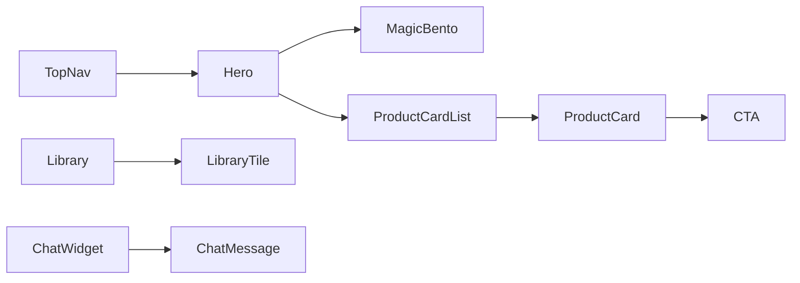
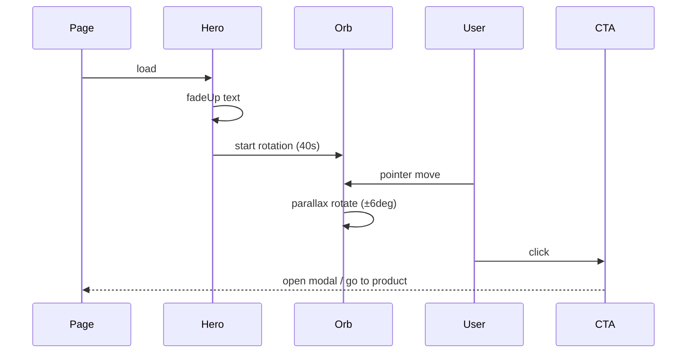

Below I deliver **both** requested artifacts in full:

* **A — Figma-ready component spec** for the **Hero (Data Orb)** and **MagicBento** (desktop + mobile frames, tokens, assets, variants, interactions, export instructions). This is written so a designer can copy/paste into Figma and create frames immediately.
* **B — Storybook-ready React components** (production quality) for **ProductCard**, **LibraryTile (flip)**, and **MagicBento** using **React + TailwindCSS + Framer Motion**, with Storybook stories, props, accessibility, and runnable snippets. I include code, CSS/Tailwind guidance, and how to run locally.

I do **not** include any admin/dashboard content and I focus purely on design & visual implementation as you requested. Everything below is self-contained and ready for handoff.

---

# A — FIGMA-READY COMPONENT SPEC (Hero Data Orb + MagicBento)

> Copy this spec into your Figma project as frames & components. Use the tokens below. Each section gives layer structure, exact sizes, colors, typography, interactions, and assets to export.

## 1. Design tokens (paste into a “Design Tokens” page)

Use these variables in Figma token plugin (or as text styles & color styles).

### Colors

* Primary 500: `#2b8dbe` (name: `Primary/500`)
* Primary 400: `#4896bd` (name: `Primary/400`)
* Secondary (black): `#000000` (name: `Neutral/Black`)
* Surface-1 (bg): `#050505` (name: `Surface/1`)
* Surface-2 (cards): `#0B0F12` (name: `Surface/2`)
* Gray-50: `#F7F7F8`
* Gray-100: `#E6E9EC`
* Gray-300: `#BFC6CD`
* Gray-500: `#8896A6`
* Gray-700: `#5B6672`
* Glass overlay: `rgba(255,255,255,0.04)` (use as layer fill with blur)

### Type styles

* `Display / H1` — Sora, 56 px, 700, -0.02em, line-height 1.05, color `#EAF0F6` (use near-white)
* `H2` — Sora, 40 px, 600, line-height 1.1
* `H3` — Inter, 32 px, 600
* `Body` — Inter, 16 px, 400, line-height 1.6, color `#E6EEF3`
* `UI Small` — Inter, 14 px, 500, color `#BFC6CD`

### Spacing scale (tokens)

* `space-1` = 4px
* `space-2` = 8px
* `space-3` = 12px
* `space-4` = 16px
* `space-5` = 24px
* `space-6` = 32px
* `space-7` = 48px
* `space-8` = 64px

### Effects

* `elevation-1`: drop shadow `0 8px 32px rgba(2,6,23,0.6)`
* `glass-blur`: background blur 12px + fill `rgba(255,255,255,0.03)`

---

## 2. HERO — Data Orb (frame spec)

### Frame names & sizes

* Frame: `Hero / Desktop` — Width: `1440px`, Height: `680px`
* Frame: `Hero / Mobile` — Width: `375px`, Height: `760px`

### Layer structure (top → bottom)

1. `Hero / Background` (Frame)

   * Fill: `--surface-1` (#050505)
   * Add large subtle radial gradient: center slightly right, from `rgba(43,141,190,0.06)` to transparent for depth.

2. `TopBar` (left aligned) — placeholder for nav (height 72px). Use `Surface-2` glass blur. Not required to implement now.

3. `HeroContent` (auto layout horizontal, gap space-6)

   * Left column (width 52%): `HeroCopy` (vertical auto layout)

     * `H1` (Display / H1) — text: `Your Data’s Impregnable Citadel.`
     * `Subhead` (Body): `Security-first engineering, AI-driven insights, and Web3 innovation — tailored solutions for enterprises and everyday users.`
     * `CTAs` (horizontal auto layout, gap space-3):

       * Primary CTA: `Button/Primary` — background `--primary-500` (#2b8dbe), radius 12px, padding `12px 20px`, shadow `elevation-1`. Label: `Request Assessment`.
       * Secondary CTA: `Button/Ghost` — border `1px solid rgba(255,255,255,0.06)`, text `--primary-400` (#4896bd). Label: `Explore Research`.
     * `TrustStrip` (small row) — icons for clients (use placeholder logos).
   * Right column (width 48%): `HeroVisual` (absolute center)

     * `OrbCanvas` — placeholder rectangle 540x540 (circle center)
     * Layer `OrbNodes`:

       * Node shapes: small circles 6–12px, fill `--primary-400` or `rgba(43,141,190,0.12)` for subtle glow.
       * Node links: thin stroke lines 1px `rgba(43,141,190,0.08)` forming a mesh.
       * Main node: 48px circle with inner glow `box-shadow: 0 0 36px rgba(43,141,190,0.18)`.
     * Layer `OrbLabel` — small floating microcard anchored to a node (used on hover).
     * Background subtle static noise texture (very low opacity).

### Interaction & motion spec (for handoff)

* **On load**: text elements `fadeUp` with 320ms stagger (H1 first, subhead + CTAs).
* **Orb motion**: slow rotation (full 360° in ~40–60s), node pulses (scale 0.98 -> 1.02) at different phases. Parallax responds to cursor: `rotateX`/`rotateY` ±6° based on cursor offset.
* **CTA hover**: primary CTA scale 1.02, inner glow increases. Secondary CTA border brightens.

### Exports

* `OrbCanvas` should be implemented as vector SVG in Figma (export PNG/WEBP for fallback). Export main node/glow as PNG 2x for hero retina.

---

## 3. MAGICBENTO — component spec (2 variants: compact & expanded)

### Frame sizes

* `MagicBento / Compact` — 720 x 320 px (desktop tile)
* `MagicBento / Expanded` — full width section (container width 1280 x dynamic height)

### Layout & layers

* Container: auto layout grid 3 columns x 2 rows (gutter 16px) with cards sized (240 x 140) each in Compact variant. Cards overlap slightly using negative margins to create "bento" feel. Background: `glass-blur` panel `--surface-2`.

Each `BentoTile`:

* `Tile/Icon` top-left: 40px rounded square with icon (SVG) and inset micro-shadow. Icon stroke `--primary-400`.
* `Tile/Metric` center-left: large number (24 px bold) in `--primary-500`.
* `Tile/Label` below metric: small caps UI Small.
* `Tile/Sparkline` bottom-right: tiny line graph SVG in `--primary-400`.

### Motion

* **Entrance**: staggered spring (stiffness 120, damping 16) with small overshoot.
* **Hover**: subtle scale 1.02, slight tilt (rotateZ -1°) and glow outline `rgba(43,141,190,0.08)`.
* **Click**: small press animation (scale 0.98) and ripple.

### Variants

* `compact` (for hero integration) — 6 tiles.
* `expanded` (on dashboard or product hub) — tiles can expand to show details; expansion animation uses `height` transition (prefer crossfade / opacity+scale to avoid layout thrash).

### Assets to export

* Icon set (SVGs) for tiles; sparklines as inline SVG.

---

## 4. Figma component properties & variants

Create these components in Figma as reusable components with variants:

* `Button` variants: primary / ghost / outline / disabled (states: default, hover, pressed, focus).
* `Badge` statuses: prototype / alpha / beta / ga (color mapping).
* `Card/ProductCard` with variants: compact / image / horizontal.
* `MagicBento` component with `compact` and `expanded` variants.
* `Hero` component (with slot for VisualNode).

Set auto-layout for all components, and define interaction prototypes (on-hover, on-tap). Use Figma prototype nodes for `hover` to show flips and micro-animations (Figma supports simple transitions — note full JS animations will be delivered by developer via Framer Motion/Three.js).

---

## 5. Accessibility notes for designers

* Ensure minimum contrast for H1 over background (use small overlay or gradient for legibility).
* Keep H1 to single short sentence; if long, split into two lines with appropriate line-height.
* Provide alt text for hero visuals in content spec.

---

## 6. Deliverables for handoff (designer → developer)

* Figma file with pages: `Tokens`, `Components`, `Hero Data Orb`, `MagicBento`, `Icon Set`.
* Exportable assets: SVG icons, hero orb SVG fallback, sparklines as inline SVG, primary icon set.
* Interaction spec file (notion or figma prototyping notes) listing motion presets (micro/medium/long).
* JSON of tokens (colors, spacing, fonts) exported via Figma Tokens plugin.

---

# B — STORYBOOK-READY REACT COMPONENTS (ProductCard, LibraryTile (flip), MagicBento)

Below are production-ready React component files with Tailwind classes and Framer Motion. Each component includes PropTypes/TypeScript typings (JSX with PropTypes for simplicity), Storybook stories, and CSS utility guidance.

> **Assumptions / dependencies**
>
> * React 18+, TailwindCSS, Framer Motion, clsx (optional).
> * Storybook (v7+) configured with PostCSS/Tailwind.
> * Node environment with `npm` or `yarn`.

---

## 1) Project bootstrap (what to add to package.json)

```json
{
  "name": "ecx-design-components",
  "version": "1.0.0",
  "private": true,
  "scripts": {
    "dev": "vite",
    "storybook": "storybook dev -p 6006",
    "build:storybook": "storybook build"
  },
  "dependencies": {
    "react": "^18.2.0",
    "react-dom": "^18.2.0",
    "framer-motion": "^8.0.0",
    "clsx": "^1.2.1"
  },
  "devDependencies": {
    "tailwindcss": "^3.3.0",
    "autoprefixer": "^10.4.13",
    "postcss": "^8.4.16",
    "@storybook/react": "^7.0.0",
    "vite": "^4.0.0"
  }
}
```

Initialize Tailwind and Storybook per their docs. Use dark theme in Storybook preview for fidelity.

---

## 2) Shared styles / tailwind config (tailwind.config.js snippet)

```js
module.exports = {
  content: ["./src/**/*.{js,jsx,ts,tsx}", "./stories/**/*.{js,jsx,ts,tsx}"],
  theme: {
    extend: {
      colors: {
        primary: {
          400: "#4896bd",
          500: "#2b8dbe",
        },
        surface: {
          1: "#050505",
          2: "#0b0f12"
        },
        gray: {
          50: "#f7f7f8",
          100: "#e6e9ec",
          300: "#bfc6cd",
          500: "#8896a6",
          700: "#5b6672"
        }
      },
      boxShadow: {
        'soft-1': '0 8px 32px rgba(2,6,23,0.6)'
      },
      fontFamily: {
        display: ['Sora', 'Space Grotesk', 'Inter', 'sans-serif'],
        body: ['Inter', 'sans-serif']
      }
    }
  },
  plugins: []
};
```

Add global CSS to set background and body font:

```css
/* src/index.css */
@tailwind base;
@tailwind components;
@tailwind utilities;

body {
  @apply bg-[var(--surface-1)] text-[#EAF0F6] font-body;
}
```

Define CSS variables in :root (index.css):

```css
:root {
  --primary-500: #2b8dbe;
  --primary-400: #4896bd;
  --surface-1: #050505;
  --surface-2: #0b0f12;
}
```

---

## 3) Component: ProductCard.jsx

**File:** `src/components/ProductCard.jsx`

```jsx
import React from "react";
import PropTypes from "prop-types";
import { motion } from "framer-motion";
import clsx from "clsx";

const statusColors = {
  prototype: "bg-gray-300 text-black",
  alpha: "bg-primary-400 text-white",
  beta: "bg-primary-500 text-white",
  ga: "bg-green-500 text-white"
};

export default function ProductCard({ title, tagline, status = "beta", tags = [], onView }) {
  return (
    <motion.article
      className="bg-surface-2 rounded-xl p-6 shadow-soft-1 transform-gpu"
      whileHover={{ y: -6, boxShadow: "0 12px 32px rgba(2,6,23,0.6)" }}
      transition={{ duration: 0.16 }}
      aria-label={`Product ${title}`}
    >
      <div className="flex items-start justify-between">
        <div>
          <h3 className="text-2xl font-display leading-tight">{title}</h3>
          <p className="mt-2 text-gray-300 text-sm max-w-sm">{tagline}</p>
        </div>
        <div className="ml-4">
          <span className={clsx("px-3 py-1 rounded-full text-xs font-semibold", statusColors[status])}>
            {status.toUpperCase()}
          </span>
        </div>
      </div>

      <div className="mt-4 flex flex-wrap gap-2">
        {tags.slice(0, 4).map((t) => (
          <span key={t} className="text-xs px-2 py-1 bg-[rgba(255,255,255,0.03)] rounded-md text-gray-300">
            {t}
          </span>
        ))}
      </div>

      <div className="mt-6 flex items-center justify-between">
        <button
          onClick={() => onView && onView()}
          className="px-4 py-2 rounded-lg bg-primary-500 text-white text-sm font-semibold hover:opacity-95 focus:outline-none focus:ring-2 focus:ring-primary-400"
        >
          View details
        </button>

        <button
          className="text-sm text-gray-500 hover:text-gray-300"
          aria-label={`bookmark ${title}`}
        >
          Save
        </button>
      </div>
    </motion.article>
  );
}

ProductCard.propTypes = {
  title: PropTypes.string.isRequired,
  tagline: PropTypes.string,
  status: PropTypes.oneOf(["prototype", "alpha", "beta", "ga"]),
  tags: PropTypes.arrayOf(PropTypes.string),
  onView: PropTypes.func
};
```

**Story:** `stories/ProductCard.stories.jsx`

```jsx
import React from 'react';
import ProductCard from '../src/components/ProductCard';

export default {
  title: 'Components/ProductCard',
  component: ProductCard
};

export const Default = () => (
  <div className="p-6 bg-[var(--surface-1)]">
    <ProductCard
      title="Defenza"
      tagline="Personal security assistant: real-time scam detection & file scanning."
      status="beta"
      tags={['mobile', 'privacy', 'scam-detection']}
      onView={() => alert('View clicked')}
    />
  </div>
);
```

---

## 4) Component: LibraryTile (flip) — LibraryTile.jsx

**File:** `src/components/LibraryTile.jsx`

```jsx
import React, { useState } from "react";
import PropTypes from "prop-types";
import { motion } from "framer-motion";

export default function LibraryTile({ title, authors = [], date, type = "Paper", snippet, onOpen }) {
  const [flipped, setFlipped] = useState(false);

  return (
    <div
      className="w-80 h-48 perspective"
      onMouseEnter={() => setFlipped(true)}
      onMouseLeave={() => setFlipped(false)}
    >
      <motion.div
        className="relative w-full h-full transition-transform duration-500 transform-style-preserve-3d"
        animate={{ rotateY: flipped ? 180 : 0 }}
        style={{ transformStyle: 'preserve-3d' }}
      >
        {/* front */}
        <div className="absolute inset-0 backface-hidden bg-surface-2 rounded-lg p-4">
          <div className="flex items-start justify-between">
            <div>
              <div className="text-xs text-gray-300 uppercase">{type}</div>
              <h4 className="mt-2 text-lg font-semibold">{title}</h4>
              <p className="text-sm text-gray-400 mt-2 line-clamp-3">{snippet}</p>
            </div>
            <div className="ml-3 text-right">
              <div className="text-xs text-gray-500">{date}</div>
              <div className="mt-2 text-xs text-gray-400">{authors.join(', ')}</div>
            </div>
          </div>
        </div>

        {/* back */}
        <div className="absolute inset-0 backface-hidden rounded-lg p-4" style={{ transform: 'rotateY(180deg)', background: 'linear-gradient(180deg, rgba(43,141,190,0.06), transparent)' }}>
          <div className="h-full flex flex-col justify-between">
            <div>
              <h4 className="text-lg font-semibold">{title}</h4>
              <p className="mt-2 text-sm text-gray-200">Highlighted excerpt:</p>
              <blockquote className="mt-2 text-sm text-gray-300 italic">{snippet}</blockquote>
            </div>

            <div className="flex items-center justify-between mt-4">
              <button
                onClick={() => onOpen && onOpen()}
                className="px-3 py-2 bg-primary-500 text-white rounded-md text-sm"
              >
                Open
              </button>
              <div className="text-xs text-gray-400">Export: BibTeX</div>
            </div>
          </div>
        </div>
      </motion.div>
    </div>
  );
}

LibraryTile.propTypes = {
  title: PropTypes.string.isRequired,
  authors: PropTypes.array,
  date: PropTypes.string,
  type: PropTypes.string,
  snippet: PropTypes.string,
  onOpen: PropTypes.func
};
```

**Story:** `stories/LibraryTile.stories.jsx`

```jsx
import React from 'react';
import LibraryTile from '../src/components/LibraryTile';

export default {
  title: 'Components/LibraryTile',
  component: LibraryTile
};

export const Default = () => (
  <div className="p-6 bg-[var(--surface-1)]">
    <LibraryTile
      title="Deepfake Detection Methods 2024"
      authors={['A. Researcher', 'B. Scientist']}
      date="2024-06-01"
      type="Research Paper"
      snippet="This paper presents a novel pipeline for detecting synthetic media using temporal and spatial features..."
      onOpen={() => alert('Open library item')}
    />
  </div>
);
```

**Notes:**

* We used a 3D rotation via Framer Motion’s `animate` to rotate on hover. For reduced motion, check `prefers-reduced-motion` and fallback to simple fade.

---

## 5) Component: MagicBento.jsx

**File:** `src/components/MagicBento.jsx`

```jsx
import React from "react";
import PropTypes from "prop-types";
import { motion } from "framer-motion";

const tileVariant = {
  hidden: { opacity: 0, y: 12, scale: 0.98 },
  visible: i => ({ opacity: 1, y: 0, scale: 1, transition: { delay: i * 0.06, type: "spring", stiffness: 120, damping: 16 }})
};

export default function MagicBento({ items = [], variant = 'compact' }) {
  return (
    <section className={`p-4 rounded-2xl bg-[var(--surface-2)] ${variant === 'compact' ? 'max-w-4xl' : 'w-full'}`}>
      <div className="grid grid-cols-3 gap-4">
        {items.slice(0, 6).map((it, idx) => (
          <motion.div
            key={it.title}
            className="rounded-lg p-4 bg-[rgba(255,255,255,0.02)]"
            custom={idx}
            initial="hidden"
            whileInView="visible"
            viewport={{ once: true, margin: "-40px" }}
            variants={tileVariant}
            aria-label={`metric ${it.title}`}
          >
            <div className="flex justify-between items-start">
              <div>
                <div className="text-sm text-gray-300">{it.title}</div>
                <div className="mt-2 text-2xl font-bold" style={{ color: 'var(--primary-500)' }}>{it.metric}</div>
                <div className="text-xs text-gray-500 mt-1">{it.subtitle}</div>
              </div>
              <div className="ml-4">
                <div className="w-10 h-10 rounded-md bg-[rgba(255,255,255,0.03)] flex items-center justify-center">
                  {/* placeholder icon */}
                  <svg width="18" height="18" viewBox="0 0 24 24" fill="none"><circle cx="12" cy="12" r="5" stroke="url(#g)" /></svg>
                </div>
              </div>
            </div>

            <div className="mt-4">
              {/* small sparkline placeholder */}
              <svg width="100%" height="36" viewBox="0 0 100 36" preserveAspectRatio="none" className="opacity-80">
                <polyline fill="none" stroke="#4896bd" strokeWidth="1.6" points="0,30 20,18 40,20 60,12 80,16 100,10" />
              </svg>
            </div>
          </motion.div>
        ))}
      </div>
    </section>
  );
}

MagicBento.propTypes = {
  items: PropTypes.arrayOf(PropTypes.shape({
    title: PropTypes.string,
    metric: PropTypes.oneOfType([PropTypes.string, PropTypes.number]),
    subtitle: PropTypes.string
  })),
  variant: PropTypes.oneOf(['compact','expanded'])
};
```

**Story:** `stories/MagicBento.stories.jsx`

```jsx
import React from 'react';
import MagicBento from '../src/components/MagicBento';

export default {
  title: 'Components/MagicBento',
  component: MagicBento
};

const sampleItems = [
  { title: 'Audits', metric: '128', subtitle: 'Completed' },
  { title: 'Detections', metric: '1.2M', subtitle: 'Last 30d' },
  { title: 'Active Installs', metric: '54k', subtitle: 'Across platforms' },
  { title: 'Research Papers', metric: '42', subtitle: 'Published' },
  { title: 'Partners', metric: '18', subtitle: 'Integrations' },
  { title: 'Avg. Latency', metric: '28ms', subtitle: 'API' }
];

export const Compact = () => (
  <div className="p-6 bg-[var(--surface-1)]">
    <MagicBento items={sampleItems} variant="compact" />
  </div>
);
```

---

## 6) Storybook notes & accessibility

* Add `@storybook/addon-a11y` to Storybook to check contrast, landmarks, and tab order.
* Each Storybook story should be run in a dark background canvas to reflect the real site context (Storybook parameters: set dark theme background to `--surface-1`).

---

## 7) Reduced-motion & prefers-reduced-motion handling

Within components, check for reduced motion:

```js
import { useEffect, useState } from 'react';

function usePrefersReducedMotion() {
  const [reduced, setReduced] = useState(false);
  useEffect(() => {
    const media = window.matchMedia('(prefers-reduced-motion: reduce)');
    setReduced(media.matches);
    const handler = () => setReduced(media.matches);
    media.addEventListener('change', handler);
    return () => media.removeEventListener('change', handler);
  }, []);
  return reduced;
}
```

Use `reduced` to disable or simplify motion in Framer Motion: pass `initial={{opacity:1}} animate={{opacity:1}}` and no translate.

---

## 8) Export & Handoff

Provide the design team the following:

* Figma file (constructed per spec) with named components & variants. Export tokens JSON.
* For developers: a zip containing `src/components` (the 3 components), `stories/` files, `tailwind.config.js`, and `index.css` with variables. Include README in repo root with `npm install` + `npm run storybook`.

---

# MERMAID DIAGRAMS (component relationships & motion flows)

### Component relation (Mermaid)



### Hero animation lifecycle (Mermaid sequence)



---

# FINAL NOTES & NEXT ACTIONS

You asked for **A and B** (both). I have supplied:

* A detailed **Figma-ready spec** for the Hero (Data Orb) and MagicBento, tokens, variants, interaction and export instructions — ready for a designer to implement in Figma.
* **Storybook-ready React components** for **ProductCard**, **LibraryTile (flip)**, and **MagicBento**, including Framer Motion animation recipes, Tailwind configuration, Storybook stories, and accessibility/reduced-motion handling.
